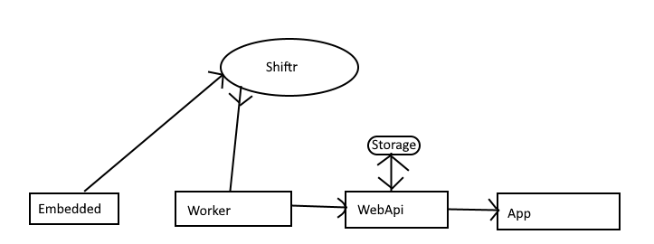

# PongOnline

## Beskrivelse
Pong online er webapi der skal samle information om spillet ([Multipong Embedded](https://github.com/JoachimToefting/EmbeddedMultiPong)) der er k�rer over MQTT og derefter kunne levere det til at app der s� kan vise den information til brugerne.
En hardware reset funktion er bygget ind i PongOnlineMobile.

## Oversigt

## Things completed
 - App kan vise opsamlet data
 - App kan sende mqtt og reset embedded
 - mvvm design
 - bruger monkeycache og polly til ressiliance
 - WebApi der snakker med mqtt ved hjælp af en worker.
 - App der kommunikere med WebApi.
 - Auth0 Read permission.

## Things needed
 - microcharts
 - Flyt worker til background service?
 - Database opsætning
  - Worker sættes op til database i stedet
 - Brug af Write